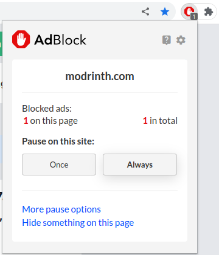
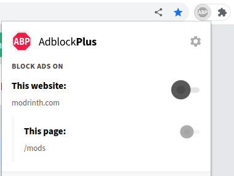
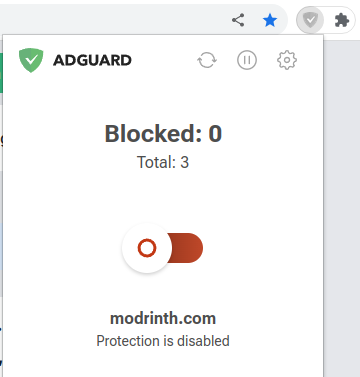
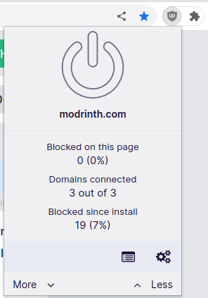
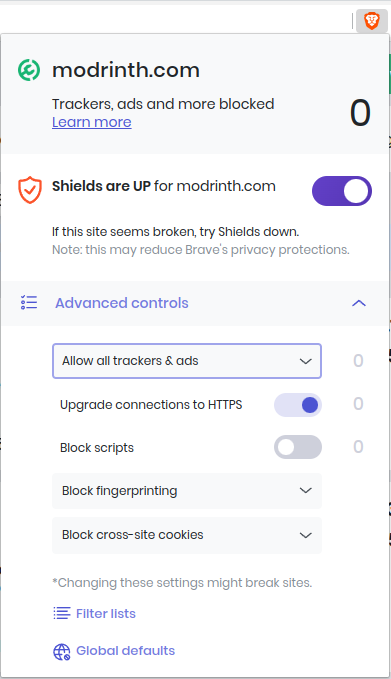
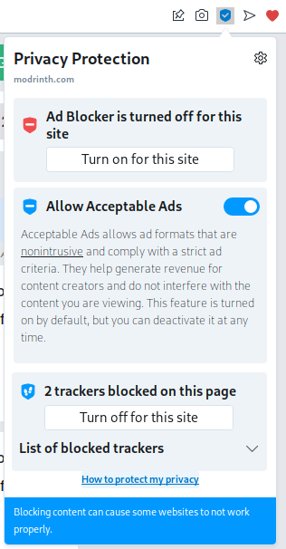
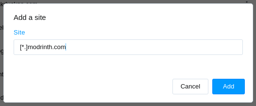
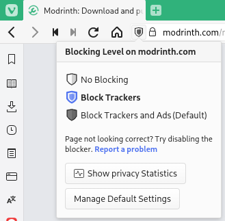
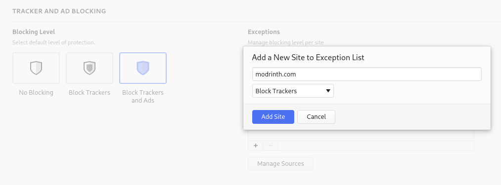

import Tabs from '@theme/Tabs';
import TabItem from '@theme/TabItem';

# Adrinth (Modrinth's Advertising)

Modrinth makes use of an in-house network called [Adrinth](https://adrinth.com). 90% of the ad revenue from all pages goes directly to creators. The remaining 10% of ad revenue pay for Modrinth's upkeep costs and allow us to continue to exist.

Adrinth ads are fully compliant with GDPR, CCPA, and other privacy laws, and fall under the [Acceptable Ads Standard](https://acceptableads.com/standard/). There is only ever one per page, they are less than 120 pixels tall, and they are separate and distinguishable from actual site content.

While you are not required to turn off your adblocker to access Modrinth, you would be supporting both Modrinth and its creators in the process. For the benefit of everyone involved, we humbly request that you turn off your adblocker. You can use the links on the right side to navigate to your browser or browser extension.

If none of the methods shown work or if you have more questions about Adrinth, please join us on [Discord](https://discord.modrinth.com) so that we can assist you!

## Browser Extensions

### AdBlock

AdBlock is configurable by clicking its logo, either within or next to the Extensions button (usually a puzzle piece or a double right chevron).

<Tabs>
<TabItem value="settings" label="Configure AdBlock via its settings panel">

From within the settings panel, it is very easy to disable ads on Modrinth. Simply click `Always` under `Pause on this site`.

If this still didn't work, your browser may have its own protection as well. Please refer to your browser's section on this page.

</TabItem>
</Tabs>

### Adblock Plus

Adblock Plus is configurable by clicking its logo, either within or next to the Extensions button (usually a puzzle piece or a double right chevron).

<Tabs>
<TabItem value="settings" label="Configure Adblock Plus via its settings panel">

From within the settings panel, it is very easy to disable ads on Modrinth. Simply click the toggle for `This website` and refresh when prompted.

If this still didn't work, your browser may have its own protection as well. Please refer to your browser's section on this page.

</TabItem>
</Tabs>

### AdGuard

AdGuard is configurable by clicking its logo, either within or next to the Extensions button (usually a puzzle piece or a double right chevron).

<Tabs>
<TabItem value="settings" label="Configure AdGuard via its settings panel">

From within the settings panel, it is very easy to disable ads on Modrinth. Simply click the toggle and you're done!

If this still didn't work, your browser may have its own protection as well. Please refer to your browser's section on this page.

</TabItem>
</Tabs>

### uBlock Origin

uBlock Origin is configurable by clicking its logo, either within or next to the Extensions button (usually a puzzle piece or a double right chevron).

<Tabs>
<TabItem value="settings" label="Configure uBlock Origin via its settings panel">

From within the settings panel, it is very easy to disable ads on Modrinth. Simply click the big blue power button and then click the rotating arrows beside it to refresh the page.

If this still didn't work, your browser may have its own protection as well. Please refer to your browser's section on this page.

</TabItem>
</Tabs>

## Browsers

### Brave

Brave has a built-in adblocker which is configurable by clicking the Brave logo in the address bar.

<Tabs>
<TabItem value="settings" label="Configure ad settings from address bar">

To allow Modrinth’s ads to show from this menu, go into `Advanced controls` and change the first setting to `Allow all trackers & ads`.

Alternatively, if you don't feel comfortable touching the advanced options, you can also turn Shields to Down for Modrinth by clicking the purple toggle.

</TabItem>
</Tabs>

### Opera

Opera has a built-in adblocker which is configurable by clicking the blue shield in the address bar.

<Tabs>
<TabItem value="settings" label="Configure ad settings from address bar">

There are two ways to allow Modrinth's ads to show after clicking the blue shield. You can either:
1. Click the `Turn off for this site` button for ads, or
2. Toggle on `Allow Acceptable Ads`

The panel should look like this in the end:

</TabItem>
<TabItem value="backup" label="In case the blue shield is not visible">

If the blue shield is not visible, you can manually add an exception by going to [Opera's settings](opera://settings/adBlockerExceptions). Add an exception for `[*.]modrinth.com`.

</TabItem>
</Tabs>

### Vivaldi

Vivaldi has a built-in adblocker which is configurable by clicking the shield in the address bar.

<Tabs>
<TabItem value="settings" label="Configure ad settings from address bar">

To allow Modrinth's ads to show from this menu, downgrade the protection on Modrinth from `Block Trackers and Ads` to only `Block Trackers`.

</TabItem>
<TabItem value="backup" label="In case the shield is not visible">

If the shield is not visible, you can manually add an exception by going to [Vivaldi’s privacy settings](vivaldi://settings/privacy/). Add an exception for `modrinth.com` and set the level to `Block Trackers`.

</TabItem>
</Tabs>
