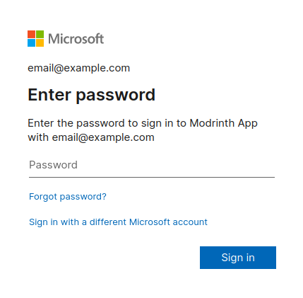

# Frequently Asked Questions - Modrinth App

For questions that are not specific to the Modrinth App, please refer to the [general FAQ](index.md). If none of these answer your questions, please join us in the `#app-support` channel of our [Discord].

## General questions

### Why is my modded game instance crashing? {#crashing}

There are many possible reasons for your game crashing. While some crashes may be caused by the Modrinth App itself, such as in the case of [Forge 1.18.2 or older on M1/M2 Mac devices](#old-forge), this is extremely rare.

#### Step 1: Updated mods

First, make sure you're using the latest version of each mod you're using. You can update very easily by clicking the "Update all" button in the top-right corner of the "Mods" section of an instance. If it's been a while since you last updated, it might take a while to download all new updates.

Next, double check to ensure that all of your mods support the loader and game version you're using. For example, mods for 1.20.1 may not work on 1.20.2.

#### Step 2: Read crash logs

Reading the log or crash report can be incredibly important in diagnosing a crash. The most common crash that can be resolved by reading logs are mods that have a failure in using "Mixin", a library very commonly used in Fabric and Quilt mods, and occasionally in Forge or NeoForge mods. If your crash log says `Caused by: org.spongepowered.asm.mixin` anywhere in it, it is likely this category of crash. If you search for `Mixin apply for mod` or `.mixins.json`, you can often find the ID of a mod that's misbehaving. For example, finding `memoryleakfix.mixins.json` in a crash log may indicate an issue with [Memory Leak Fix](https://modrinth.com/mod/memoryleakfix).

#### Step 3: Binary search method

When all else fails, the **binary search method** (also "divide and conquer") is a tried-and-true method. If you have many mods, it might seem impossible to figure out which one might be causing the crash. The binary search method allows you to determine the problematic mod very quickly, without having to disable and test mods one-by-one. Here's how it works:

1. Start by disabling half of your mods. Run the game to see if the crash still happens.
2. Does the issue still exist?
    a. If YES: Repeat from step 1 with the mods you currently have enabled.
    b. If NO: Disable all mods you currently have enabled, and enable all mods which were previously disabled.
3. Repeat this process until the problematic mod(s) have been found. Check for updates, conflicts, or incompatibilities.

Following this process, you should be able to find the problem, regardless of your loader or game version. If the game still crashes even without any mods enabled, it may be caused by the loader itself or by the Modrinth App. Check if any FAQs below, such as [broken intermediary (Fabric/Quilt)](#intermediary), [out-of-memory errors](#32bit-java), or [old Forge on M1/M2 Macs](#old-forge) solve your issues. If your game still crashes and you suspect the crash is caused by the Modrinth App, please join us in the `#app-support` channel of our [Discord]. We are unable to assist with crashes caused by a loader.

### How do I install or create a Modrinth modpack? {#modpack-basics}

Please refer to the [Modpacks on Modrinth](../modpacks/index.md) page.

### How do I share a modpack with others? {#share}

Once you have [created an `.mrpack` file](#modpack-basics), you can share this file with the world.

The main method of distribution is via the [Modrinth website](https://modrinth.com). First, log in to the website. Then, you can create a project by hovering over your avatar and clicking "Create a project". Make sure to select "Modpack" as the project type. Follow the checklist, ensuring you are following the rules and have [obtained permission to include each file](../modpacks/permissions.md). Once submitted for review, you can expect it to be reviewed by our moderators [within 24-48 hours](./index.md#review-times).

Alternatively, if your pack is only for you and a few friends, you can share the `.mrpack` file using your file host of choice — [Google Drive](https://drive.google.com), [OneDrive](https://www.microsoft.com/en-us/microsoft-365/onedrive/online-cloud-storage), [Dropbox](https://dropbox.com), etc. This method of distribution is much faster and does not involve intervention by Modrinth's moderators. However, it does not allow users to easily move between multiple versions of the same modpack.

### How do I unlock or unpair an instance? {#unpair}

When you install a modpack from Modrinth, it is paired and locked to only contain the content from that modpack. By unlocking a modpack, you can add your own content. By unpairing a modpack, you remove the link between your local installation and the modpack as available on Modrinth.

To unpair and/or unlock an instance, go into the instance options, then scroll down to "Instance management" and unpair/unlock as needed.

### How do I repair an instance? {#repair}

An instance can become corrupted for a variation of reasons. In most cases, such corruption can be fixed simply by repairing the instance. To repair an instance, go into the instance options, then scroll down to "Modpack" and repair as needed. Allow it some time to process, since this may take a while.

### Where are the Modrinth App files located? {#file-location}

The Modrinth App puts its files in a certain place depending on your operating system. These are the default values; you can change this directory in the "App directory" section of the launcher settings.

Please note: the Modrinth App **will break** if you change the app directory to any directory that requires administrator privileges, such as `Program Files` on Windows. Unless you really know what you're doing, we highly advise against changing the app directory.

#### Windows

On Windows, files are stored in `%AppData%\com.modrinth.theseus\` by default.

To navigate to this directory, press <kbd>Win</kbd> + <kbd>R</kbd> on your keyboard, then enter `%AppData%\com.modrinth.theseus\` into the dialog box.

#### Mac

On Mac, files are stored in `~/Library/Application Support/com.modrinth.theseus/` by default.

To navigate to this directory, open Finder and click on "Go" in the bar at the top of your screen. In that menu, click "Go to folder", then enter `~/Library/Application Support/com.modrinth.theseus/` into the dialog box.

#### Linux

On Linux, files are stored in `$XDG_CONFIG_HOME/com.modrinth.theseus/` (usually `~/.config/com.modrinth.theseus/`) by default.

As a Linux user, you're expected to know how to navigate to this directory yourself.

### How do I install Java? {#java}

Java is the coding language that Minecraft uses. In order to play Minecraft, you must have Java installed.

Go to your app settings by clicking the cog (⚙️) in the bottom-left. Scroll down to "Java settings". Click "Install recommended" next to both "Java 17 location" and "Java 8 location". Allow some time for both to be downloaded.

### Can I run two copies of the same instance at the same time? {#duplicate-instances}

Due to restrictions with how Minecraft interacts with its files, it is not possible to run more than one copy of an instance at the same time. As a workaround, we suggest duplicating your instances. You can do this by right-clicking on the instance and clicking "Duplicate instance".

## General errors

### Why am I getting a network error when downloading files? {#network}

Any error along the lines of "end of file before message length reached" or "Error fetching URL" shows an issue with your network. If your Internet connection is limited, you should lower the "Maximum concurrent downloads" setting in the "Resource management" section of the app settings.

### Why did my instances suddenly disappear? {#power-outage}

Sometimes, closing out of the Modrinth App without properly shutting down your computer can cause your instances to disappear. For example, this commonly occurs following a power outage. Don't worry: your instance isn't lost! In order to recover an instance, follow these steps:

1. Create a new instance using the exact same loader and game version as the instance you wish to recover.
2. Open your file manager and find the folder that contains the instance you wish to recover. This will be somewhere in the `profiles` folder of the Modrinth App directory. If you're not sure where this is, check out [Where are the Modrinth App files located?](#file-location)
3. Delete the `profile.json` file in the folder of the instance you wish to recover. Then, copy over all remaining files and folders to the new instance's folder.
4. Close out of any other instances you may have open and restart the app.

### Why am I getting an error from Fabric saying that it cannot access intermediary? {#intermediary}

This error can show as a result of a corrupted instance installation. First, locate and delete the `.jar` file it tells you has the issue. Then, [repair the instance](#repair).

### Why can't I launch Forge 1.6.4 (or older)? {#old-forge}

Due to technical restrictions, the Modrinth App does not currently support Forge installations on versions 1.5 through 1.6.4. This is a known issue, and we are working on fixing it.

## Account-related questions

### Why am I getting an error saying my account is underage? {#underage}

Microsoft only allows external launchers to play Minecraft if they are 18+ or if they are connected to a Family group. You can change your account age in [the Microsoft account settings](https://account.microsoft.com/profile) or be added to a Family group on the [Microsoft Family Safety](https://family.microsoft.com) page.

### Why can't I join multiplayer servers? (Invalid session) {#invalid-session}

If you are getting an error along the lines of "Invalid session", you must entirely close out of the Modrinth App and any other Minecraft instances you may have open. Then, open the game again. If the issue persists, [Minecraft's authentication servers may be down](https://downdetector.com/status/minecraft/). Modrinth cannot do anything about this; you must simply wait for them to work again.

### Why am I getting an error saying I don't own Minecraft, even though I do? {#own-minecraft}

In order to play Minecraft, you need to have a Minecraft username set. In order to do this, log in to [Minecraft.net](https://www.minecraft.net/en-us). Then, go to the [Profile Name](https://www.minecraft.net/en-us/msaprofile/mygames/editprofile) section. When prompted to set a username, do so here.

Once you have set a username, log into the Modrinth App. **Double-check to make sure you are using the same Microsoft account with the same email as the one you used to log in to Minecraft.net.** If it's trying to log you into a different email, click the "Sign in with a different Microsoft account" button near the bottom.

If you're sure you're logging in with the correct Microsoft account, there may be something with your configuration preventing the Modrinth App from communicating with Microsoft's servers. Try disabling any system-level or network-level ad blockers, or try setting up a VPN to a country with access to Microsoft services.

## Windows-specific questions

### Why doesn't the app boot? (Corrupted Microsoft Edge WebView2 installation) {#webview2}

The Modrinth App utilizes a specialized browser component that is native to the system it is running on. In the case of Windows, this component is the Microsoft Edge WebView2, which leverages the same technology that powers the Microsoft Edge browser.

Many users confuse it with the actual browser and mistakenly remove its files, which, unfortunately, breaks the Modrinth app. If you have made the same mistake, fear not — follow these simple steps to repair it:

1. To get started, download the [Microsoft Edge WebView2 installer](https://go.microsoft.com/fwlink/p/?LinkId=2124703) and proceed with the installation.
2. If you encounter an ‘already installed’ message, try running the installer as administrator.
3. Once the installation is complete, give the Modrinth app another go.

### Why am I getting a "IO error: Access is denied" error? (Program Files forbidden) {#program-files}

The error `I/O error: Access is denied. (os error 5)` means that you have changed the Modrinth App directory to a location that the Modrinth App does not have access to. People commonly change the app directory to `Program Files`. **Please do not do this.** The option to change the app directory is only provided for advanced users. The Modrinth App does not have access to the Program Files folder, so it will fail to read anything from there.

There are two ways you can resolve this. The first method is less destructive but takes more time. The second method is more destructive but easier.

:::danger
The Modrinth App should be closed before attempting to perform any of the steps below.
:::

#### Less destructive - manually edit config to change directory

1. Open https://jsoneditoronline.org.
2. Click "Open" -> "Open from disk".
3. In path field at the bottom, type `%AppData%\com.modrinth.theseus\settings.json` and click Open.
4. In the top click `[tree]`.
5. Find `loaded_config_dir` and change its value by double-clicking to any valid directory that you have full write access to. By default, Modrinth uses `C:\Users\<YOUR WINDOWS USERNAME>\AppData\Roaming\com.modrinth.theseus`.
6. Click "Save" -> "Save to disk".
7. When asked about name and indentation, keep everything as is, and click Save.
8. Type `%AppData%\com.modrinth.theseus\settings.json` in the path field at the bottom again, and click Save.
9. When asked whether to override the existing file, click Yes.
10. Try starting the app now.

#### Path of mass destruction - remove Modrinth's app directory

1. Open Explorer and navigate to `%AppData%\com.modrinth.theseus`.
2. Delete everything **except** `profiles` and `meta`.
3. Launch Modrinth app again and complete onboarding as usual.

### Why am I getting "out-of-memory" errors, even when I have enough memory allocated? {#32bit-java}

If you're experiencing Java memory errors when launching Minecraft 1.16.5 or older, despite having sufficient RAM, it may be due to having a 32-bit version of Java installed. Please [reinstall Java](#java).

### Why can't I launch Minecraft 1.5.2 (or older)? {#old-minecraft}

Due to technical restrictions, the Modrinth App does not currently support 1.5.2 or older on Windows. This is a known issue, and we are working on fixing it.

## Mac-specific questions

### Why can't I launch the app on macOS Catalina (or older)? {#catalina}

If you are getting an error that says "Modrinth App cannot be opened because of a problem", your macOS version is not supported. The Modrinth App is unable to support macOS Catalina or older due to missing required libraries. If you are able to upgrade to macOS Big Sur or newer, please do so.

## Linux-specific questions

### Why isn't the Modrinth App packaged for my distribution? {#packaging}

For now, the only official distributions of the Modrinth App are via AppImage and Debian files. AppImage files can run on any distribution, so we generally recommend this method, even on Debian-based distributions. Community efforts are currently underway to create packages for Flatpak and Nix; otherwise, any distribution-specific packages are not official.

[Discord]: https://discord.modrinth.com