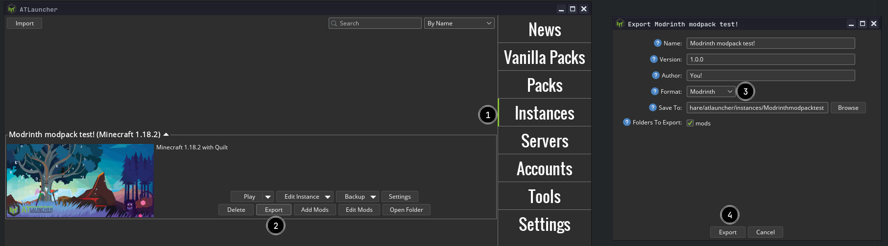
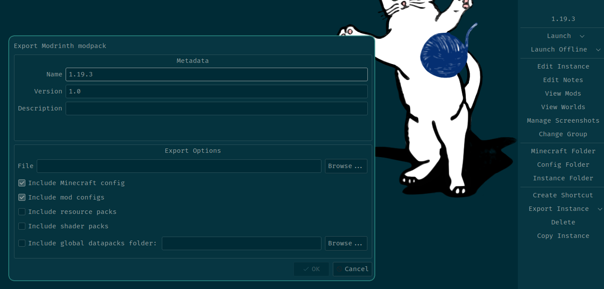
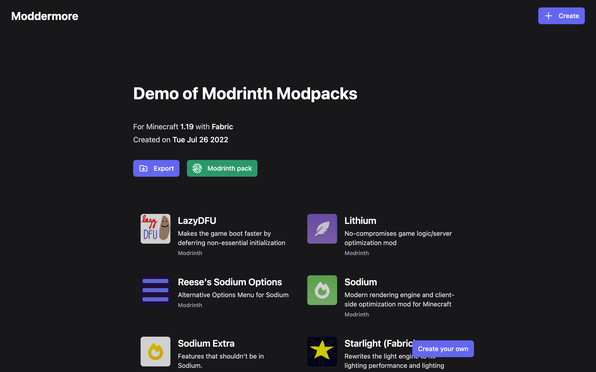

# Creating Modpacks

A modpack is a list of mods bundled with additional files, such as configuration files. In general, it's a modded instance of a game ready to play, or with minor changes.

## How do I play a modpack?

Please see the guide for [playing modpacks](playing_modpacks.md).

## What does the Modrinth format look like?

Modrinth uses its own storage layout for modpacks. This can be found on the [format definition](format_definition.md) page. The Modrinth format is unique for our purposes, so you cannot use the CurseForge format or another format to upload to Modrinth.

## How do I create a modpack?

You can either use [ATLauncher](https://atlauncher.com), [MultiMC](https://multimc.org), [packwiz](https://github.com/packwiz/packwiz), or [Moddermore](https://moddermore.net) to create modpacks.

### ATLauncher

ATLauncher is a launcher focused on easy integration of modpacks with various different platforms.

When you have an instance, it is very simple to export to the Modrinth format. You just need to select the instance, press the Export button, fill out the metadata, and press Export.

:::caution
Make sure you choose to export to the Modrinth format! If you don't change it from the default (CurseForge), the resulting pack will not be uploadable to Modrinth.
:::

:::tip
You can also convert a CurseForge modpack to the Modrinth format via ATLauncher. If you import the CurseForge modpack and then export it to the Modrinth format, it will try to use the Modrinth versions of the mods in the pack wherever possible.

The recommended method to convert packs was previously via packwiz, but we now discourage the use of packwiz for this specific use case. packwiz does not attempt to convert the CurseForge mod versions to Modrinth versions, but ATLauncher does.
:::

### MultiMC and Prism 

MultiMC and Prism are launchers focused on efficiently managing multiple separate instances of Minecraft.

You can easily export a MultiMC or Prism instance to the Modrinth format. You just need to select the instance, select the dropdown menu next to Export Instance and click Modrinth. Then, fill out the settings and metadata and press OK.

### packwiz

packwiz is a command-line application which allows easy creation of modpacks for multiple platforms and purposes. packwiz's [Getting Started](https://packwiz.infra.link/tutorials/creating/getting-started/) guide is very helpful when setting up a packwiz pack.

When you have a working packwiz pack, you can use the [`packwiz mr export`] command to create a Modrinth modpack.

[`packwiz mr export`]: https://packwiz.infra.link/reference/commands/packwiz_modrinth_export/

### Moddermore

[Moddermore](https://moddermore.net) is a website for sharing lists of mods that Minecrafters use.

You can create an instance by going to [the `Create` page](https://moddermore.net/new), where you have a few options of how you want to create the list.

Once you've created the list, there will be a `Modrinth pack` button that you can click to export to the Modrinth modpack format.

