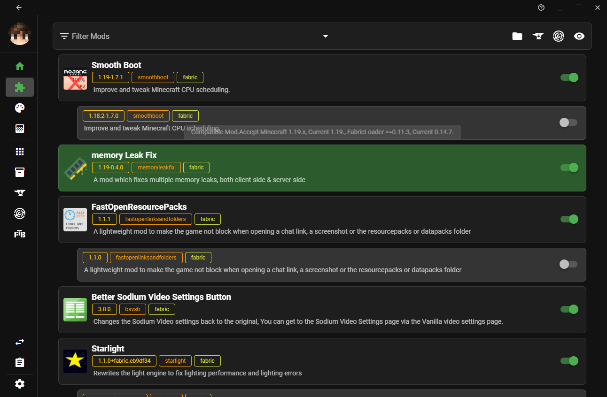
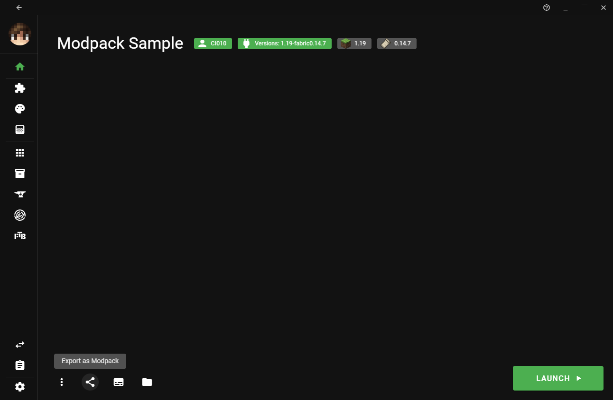
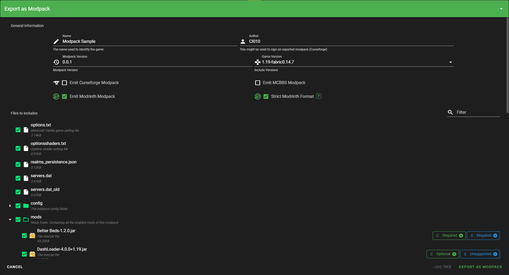

# Creating Modpacks

A modpack is a list of mods bundled with additional files, such as configuration files. In general, it's a modded instance of a game ready to play, or with minor changes.

## How do I play a modpack?

Please see the guide for [playing modpacks](playing_modpacks.md).

## What does the Modrinth format look like?

Modrinth uses its own storage layout for modpacks. This can be found on the [format definition](format_definition.md) page. The Modrinth format is unique for our purposes, so you cannot use the CurseForge format or another format to upload to Modrinth.

## How do I create a modpack?

You can either use [ATLauncher](https://atlauncher.com) or [packwiz](https://github.com/packwiz/packwiz) to create modpacks.

### ATLauncher

ATLauncher is a launcher focused on easy integration of modpacks with various different platforms.

When you have an instance, it is very simple to export to the Modrinth format. You just need to select the instance, press the Export button, fill out the metadata, and press Export.

:::caution
Make sure you choose to export to the Modrinth format! If you don't change it from the default (CurseForge), the resulting pack will not be uploadable to Modrinth.
:::

:::tip
You can also convert a CurseForge modpack to the Modrinth format via ATLauncher. If you import the CurseForge modpack and then export it to the Modrinth format, it will try to use the Modrinth versions of the mods in the pack wherever possible.

The recommended method to convert packs was previously via packwiz, but we now discourage the use of packwiz for this specific use case. packwiz does not attempt to convert the CurseForge mod versions to Modrinth versions, but ATLauncher does.
:::

### packwiz

packwiz is a command-line application which allows easy creation of modpacks for multiple platforms and purposes. packwiz's [Getting Started](https://packwiz.infra.link/tutorials/creating/getting-started/) guide is very helpful when setting up a packwiz pack.

When you have a working packwiz pack, you can use the [`packwiz mr export`] command to create a Modrinth modpack.

[`packwiz mr export`]: https://packwiz.infra.link/reference/commands/packwiz_modrinth_export/

### X Minecraft Launcher (XMCL)

X Minecraft Launcher (XMCL) is an open source Minecraft launcher which provides a disk efficient way to manage massive mods and other resources similarly to MultiMC.

You can enable/disable the mods in `Mods` section.

In home page, click the `Export as Modpack` button to open the export dialog.

You can configure your modpack in this dialog -- for example, you can the environment (client-side/server-side) for each file.

Once you done, click the `Export as Modpack` button to export to the Modrinth format.

:::caution
XMCL currently does not support download mods from GitHub or GitLab. File URLs from these sites are unsupported.
:::
