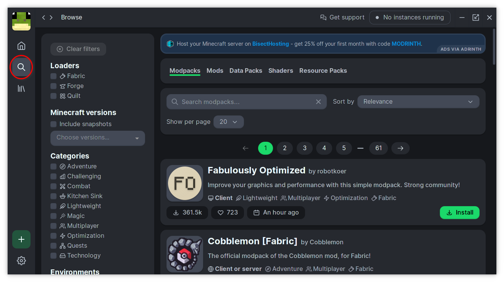
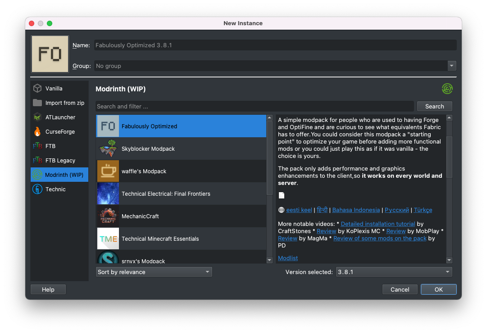
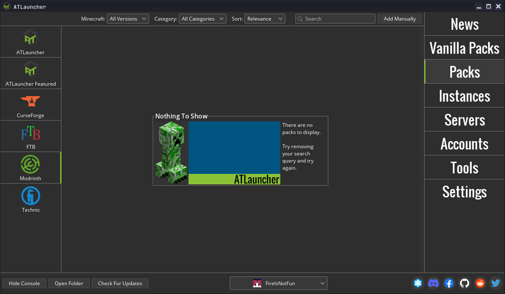
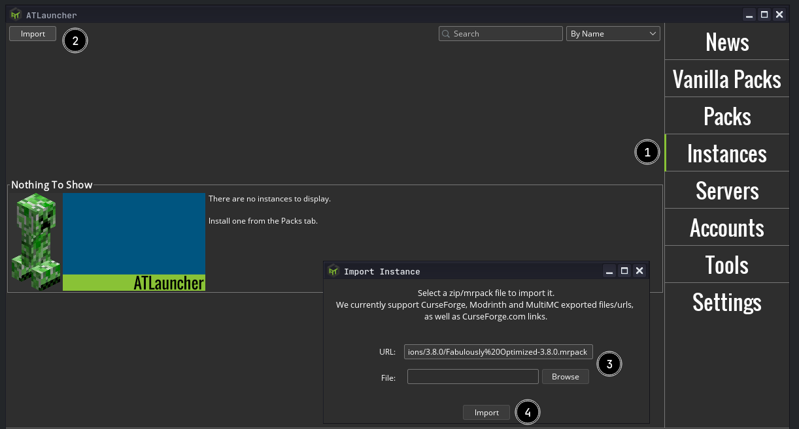
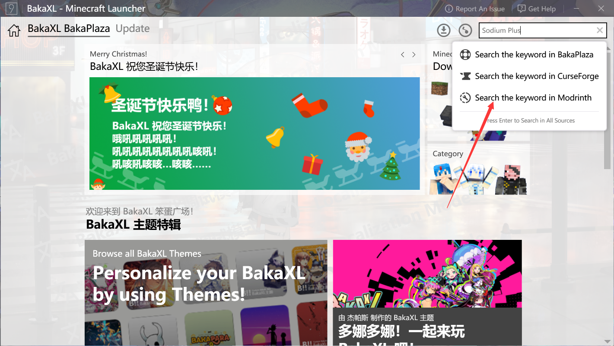
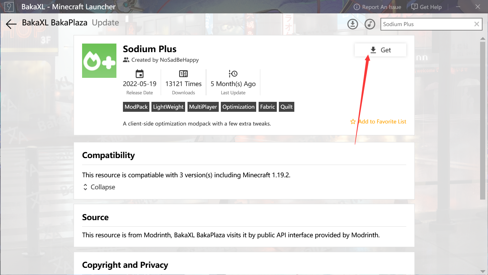
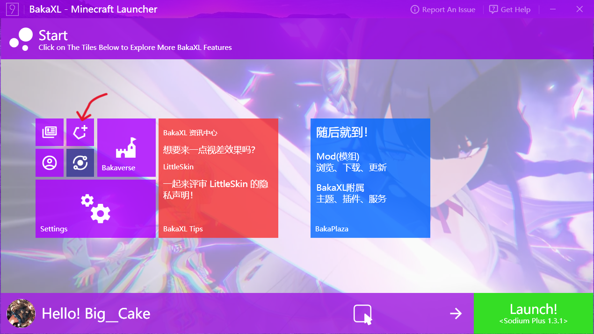

# Playing Modpacks

A modpack is a list of mods bundled with additional files, such as configuration files. In general, it's a modded instance of a game ready to play.

**[The Modrinth App](https://modrinth.com/app)** is the official solution for playing Modrinth modpacks. You can install a Modrinth modpack using the app by clicking the "Browse" button on the left side of the launcher. Then, simply click "Install" on the modpacks you want to play.

Besides [the Modrinth App](https://modrinth.com/app), the easiest ways to play a Modrinth modpack are via [MultiMC](https://multimc.org), [Prism Launcher](https://prismlauncher.org), [ATLauncher](https://atlauncher.com), or [BakaXL](https://www.bakaxl.com/).

To install a modpack on the server-side, try [mrpack-install](https://github.com/nothub/mrpack-install) or [the `itzg/minecraft-server` image](https://github.com/itzg/docker-minecraft-server) if using Docker.

### MultiMC and Prism Launcher

MultiMC and Prism are both launchers focused on efficiently managing multiple separate instances. The installation instructions for each are identical.

Modrinth packs can be installed using the "Add instance" button and clicking "Modrinth" on the left. It's as easy as selecting the one you want, and pressing "OK".

If you want to insert a URL directly, you can do so by selecting "Import from zip" instead of "Modrinth".

### ATLauncher

ATLauncher is a launcher focused on easy integration of modpacks with various different platforms.

Modrinth packs can be installed using ATLauncher in as few as three clicks. Go to the "Packs" tab, select Modrinth on the left, and search for the pack you want. Then, play!

If you just want to insert an ID, slug, or URL directly, you can also do so using the "Add Manually" button by the top-right of the search

If you have a direct link to a Modrinth pack, you also have the option of importing it using the "Import" button in the "Instances" tab.

### BakaXL (primarily for Chinese speakers)

BakaXL is a Windows-only launcher primarily targeting Chinese speakers.

#### Install through BakaPlaza

The easiest way to play modpacks using BakaXL is download it from BakaPlaza.

Click "BakaPlaza" in the Start Menu and search for the name of the modpack you want to install.

Select the modpack you want and click the "Get" button, then choose a version to download.

#### Install manually

This requires you to have a modpack file already downloaded.

Click the "Add a new Minecraft Core or Mod Pack" tile in the Start Menu, then click "Import Mod Pack".

Click "Continue" and drag the modpack file into BakaXL.
