# Playing Modpacks

A modpack is a list of mods bundled with additional files, such as configuration files. In general, it's a modded instance of a game ready to play, or with minor changes.

## How do I create a modpack?

Please see the guide for [creating modpacks](creating_modpacks.md).

## How do I play a modpack?

Currently, the easiest ways to play a Modrinth modpack are via [ATLauncher](https://atlauncher.com), [BakaXL](http://jk-insider.bakaxl.com:8888), [MultiMC](https://multimc.org), or [PolyMC](https://polymc.org). You can also install Modrinth packs if you switch to the development branch of [Hello Minecraft! Launcher (HMCL)](https://github.com/huanghongxun/HMCL).

### ATLauncher

ATLauncher is a launcher focused on easy integration of modpacks with various different platforms.

Modrinth packs can be installed using ATLauncher in as few as three clicks. Go to the "Packs" tab, select Modrinth on the left, and search for the pack you want. Then, play!

If you just want to insert an ID, slug, or URL directly, you can also do so using the "Add Manually" button by the top-right of the search

If you have a direct link to a Modrinth pack, you also have the option of importing it using the "Import" button in the "Instances" tab.

### BakaXL

:::caution
This is a Windows-only launcher. 

If you cannot download the update properly, you will need to download the latest version from [BakaXL Jenkins](http://jk-insider.bakaxl.com:8888/).

If you are interested in translating for BakaXL, check out [the translation effort](https://github.com/BakaXL-Launcher/BakaXL/tree/master/BakaXL_Software/3.0).
:::

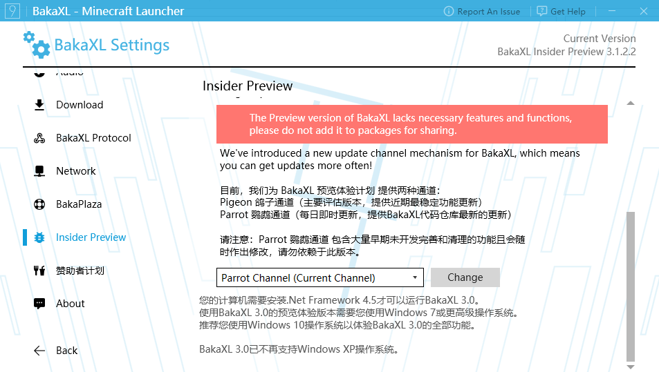

To install Modrinth packs in BakaXL, go to the Start Menu then to "Add a new Minecraft Core or Modpack" (in the upper left corner of the tiles). Click the Import Modpack button then drag and drop the .mrpack file to the page. 

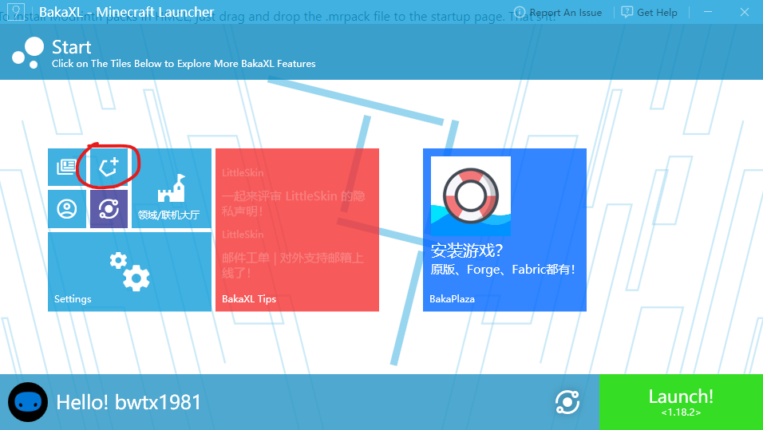

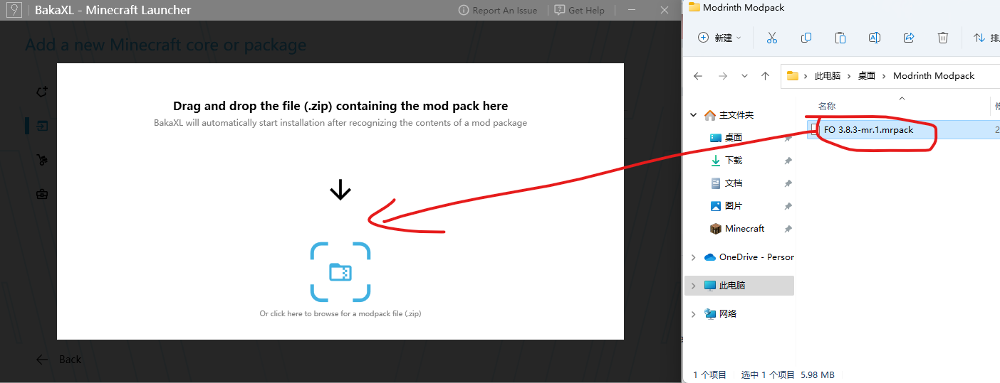

You can also use BakaPlaza to install Modpacks. Go to the Start Menu then to BakaPlaza -- the search is in the upper right corner. Click on Filters and All Sources to choose Modrinth. 

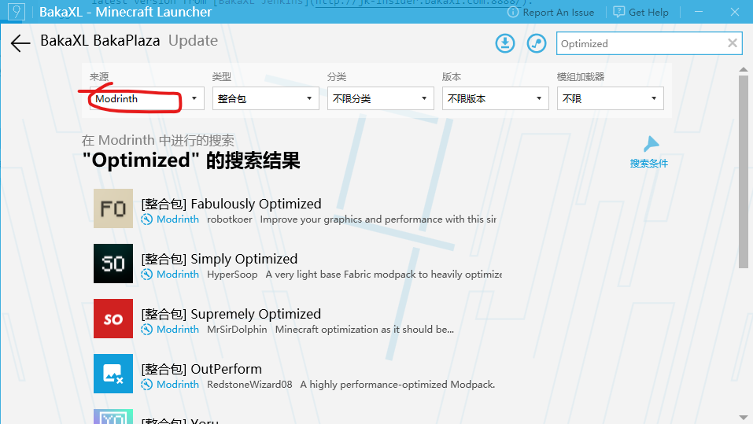

Click on the Modpack you want to install and press and Get. Choose a version and click on the download icon to install it.

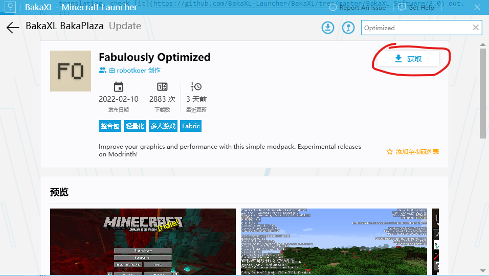

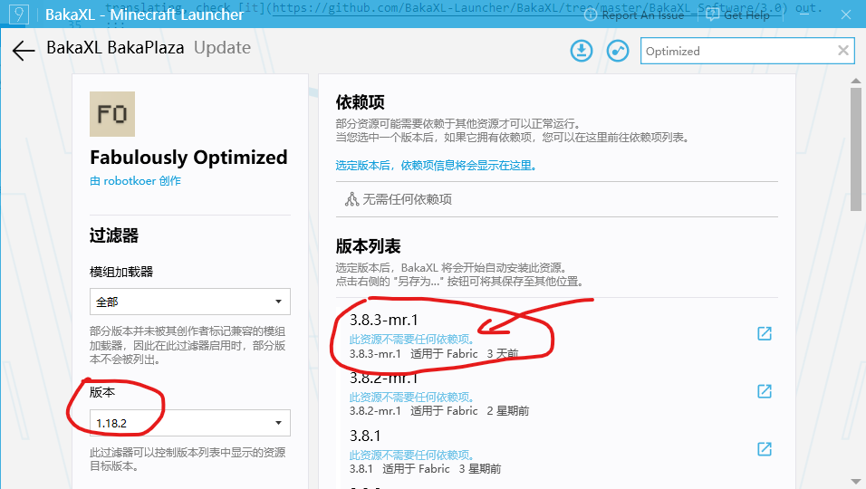

If the pack is too slow to download, go to Settings -> Download and turn off "Use mirror source in mainland China". 

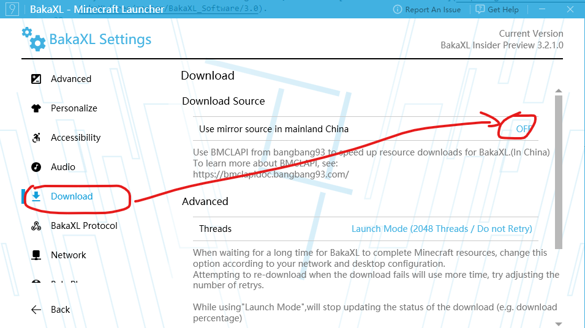

### Hello Minecraft! Launcher (HMCL)

:::caution
You must switch to the beta version of HMCL to install Modrinth packs. To check whether it is in beta version, go to Settings -> General and click Update to check if HMCL is a beta version. Otherwise, you will need to download the latest beta from [GitHub releases](https://github.com/huanghongxun/HMCL/releases).
:::

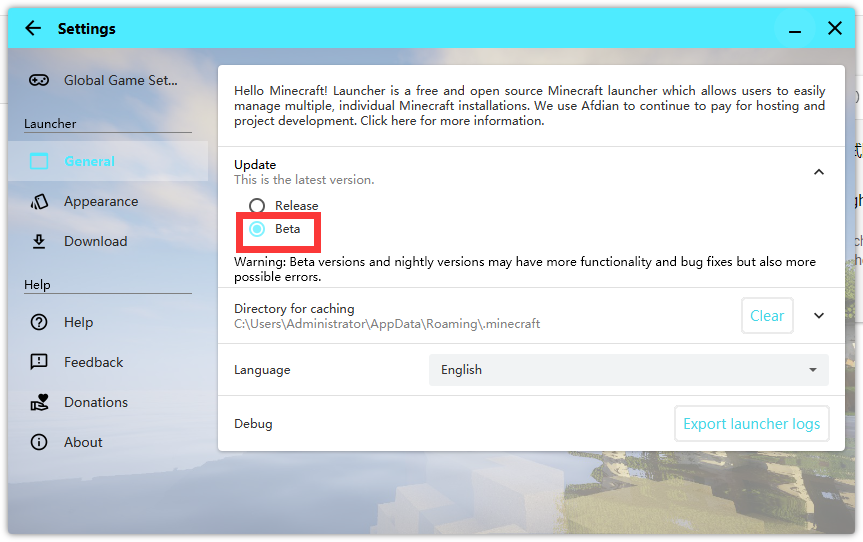

To install Modrinth packs in HMCL, just drag and drop the .mrpack file to the startup page. That's it!

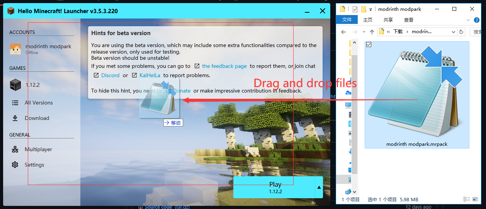

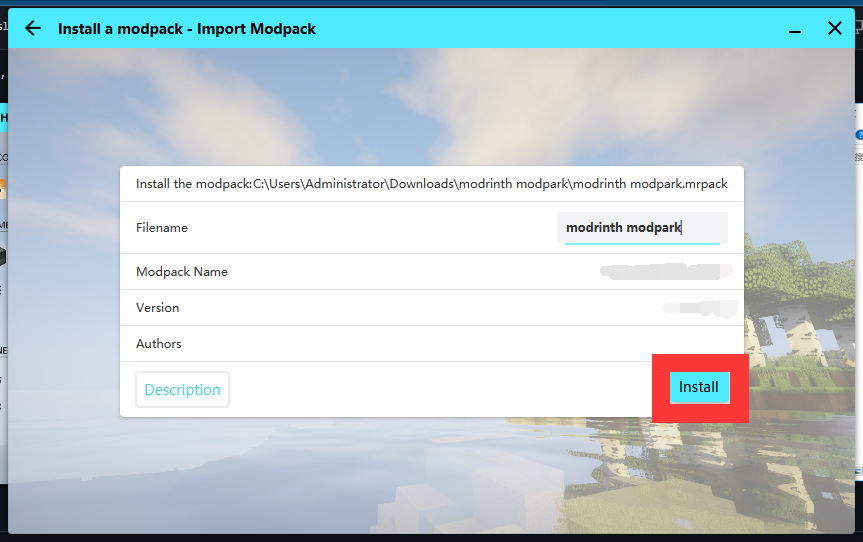

You can also use the built-in Modrinth search to get a modpack to install. In Download -> Modpack, switch the Download Source to Modrinth to search for packs to install.

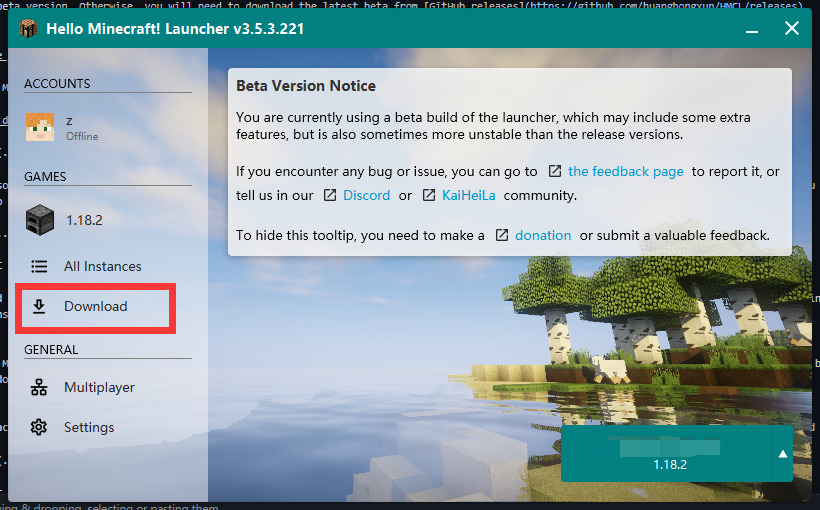

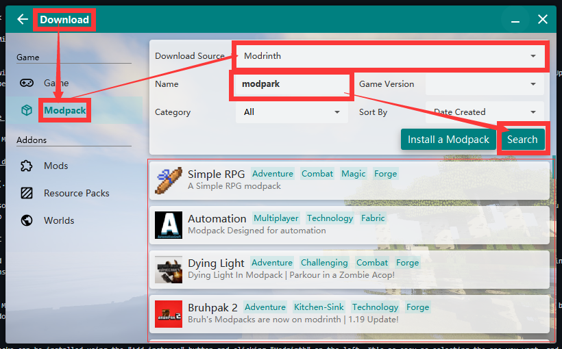

### MultiMC and PolyMC

MultiMC and PolyMC are both launchers focused on efficiently managing multiple separate instances, with the latter being a fork of the former. The installation instructions for each are identical.

Modrinth packs can be installed using the "Add instance" button and clicking "Modrinth" on the left. It's as easy as selecting the one you want, and pressing "OK".

If you want to insert a URL directly, you can do so by selecting "Import from zip" instead of "Modrinth".
