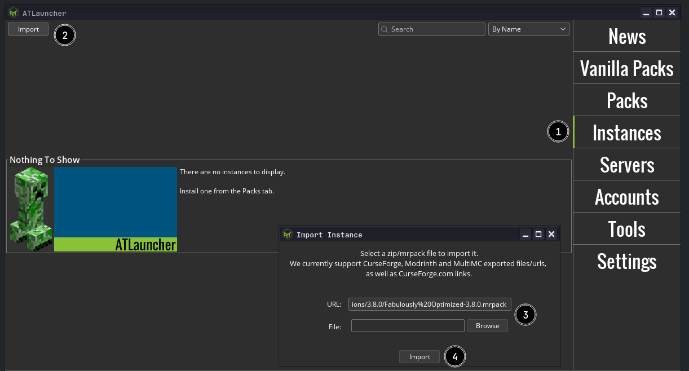

# Playing Modpacks

A modpack is a list of mods bundled with additional files, such as configuration files. In general, it's a modded instance of a game ready to play, or with minor changes.

## How do I create a modpack?

Please see the guide for [creating modpacks](creating_modpacks.md).

## How do I play a modpack?

Currently, the only stable way to play a Modrinth modpack is via [ATLauncher](https://atlauncher.com). You can also install Modrinth packs using [PolyMC](https://polymc.org/), or [MultiMC](https://multimc.org) if you switch to the development branch.

### ATLauncher

ATLauncher is a launcher focused on easy integration of modpacks with various different platforms.

Modrinth packs can be installed using ATLauncher in as few as three clicks. Go to the "Packs" tab, select Modrinth on the left, and search for the pack you want. Then, play!

If you just want to insert an ID, slug, or URL directly, you can also do so using the "Add Manually" button by the top-right of the search

If you have a direct link to a Modrinth pack, you also have the option of importing it using the "Import" button in the "Instances" tab.

### PolyMC

PolyMC is a fork of the MultiMC launcher. It has all the same features of MultiMC, along with some extra features such as mod downloading. It is capable of downloading Modrinth modpacks on it's stable build.

Modrinth packs can be installed using the "Add instance" button and clicking "Modrinth" on the left. It's as easy as selecting the one you want, and pressing "OK".

If you want to insert a URL directly, you can do so by selecting "Import from zip" instead of "Modrinth".

### MultiMC

MultiMC is a launcher focused on efficiently managing multiple separate instances.

:::caution
Modrinth packs are currently only available when using the development branch of MultiMC. To switch to the development version, click the "Settings" button at the top of the window, and change the "Update Channel" to "Development". Then, close the settings and press Update to swap to the development branch.
:::

Modrinth packs can be installed using the "Add instance" button and clicking "Modrinth (WIP)" on the left. It's as easy as selecting the one you want, and pressing "OK".

If you want to insert a URL directly, you can do so by selecting "Import from zip" instead of "Modrinth".
