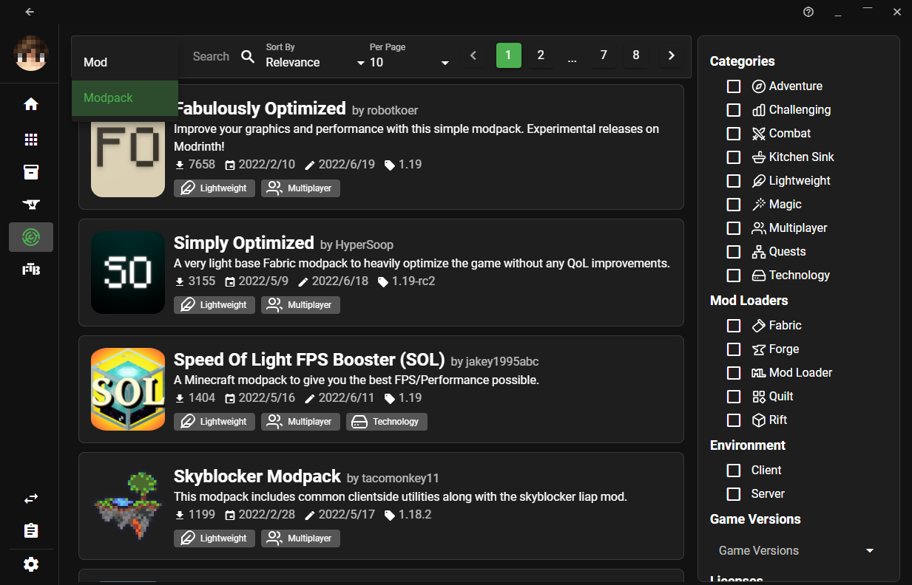
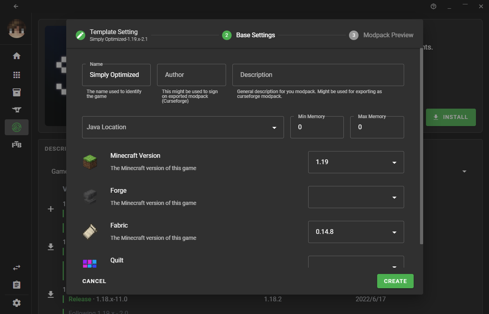

# Playing Modpacks

A modpack is a list of mods bundled with additional files, such as configuration files. In general, it's a modded instance of a game ready to play, or with minor changes.

## How do I create a modpack?

Please see the guide for [creating modpacks](creating_modpacks.md).

## How do I play a modpack?

Currently, the easiest ways to play a Modrinth modpack are via [ATLauncher](https://atlauncher.com), [MultiMC](https://multimc.org), [PolyMC](https://polymc.org), or [XMCL](https://xmcl.app). You can also install Modrinth packs if you switch to the development branch of [Hello Minecraft! Launcher (HMCL)](https://github.com/huanghongxun/HMCL).

### ATLauncher

ATLauncher is a launcher focused on easy integration of modpacks with various different platforms.

Modrinth packs can be installed using ATLauncher in as few as three clicks. Go to the "Packs" tab, select Modrinth on the left, and search for the pack you want. Then, play!

If you just want to insert an ID, slug, or URL directly, you can also do so using the "Add Manually" button by the top-right of the search

If you have a direct link to a Modrinth pack, you also have the option of importing it using the "Import" button in the "Instances" tab.

### Hello Minecraft! Launcher (HMCL)

:::caution
You must switch to the beta version of HMCL to install Modrinth packs. To check whether it is in beta version, go to Settings -> General and click Update to check if HMCL is a beta version. Otherwise, you will need to download the latest beta from [GitHub releases](https://github.com/huanghongxun/HMCL/releases).
:::

To install Modrinth packs in HMCL, just drag and drop the .mrpack file to the startup page. That's it!

You can also use the built-in Modrinth search to get a modpack to install. In Download -> Modpack, switch the Download Source to Modrinth to search for packs to install.

### MultiMC and PolyMC

MultiMC and PolyMC are both launchers focused on efficiently managing multiple separate instances, with the latter being a fork of the former. The installation instructions for each are identical.

Modrinth packs can be installed using the "Add instance" button and clicking "Modrinth" on the left. It's as easy as selecting the one you want, and pressing "OK".

If you want to insert a URL directly, you can do so by selecting "Import from zip" instead of "Modrinth".

### X Minecraft Launcher (XMCL)

X Minecraft Launcher (XMCL) is an open source Minecraft launcher which provides a disk efficient way to manage massive mods and other resources similarly to MultiMC.

You can find the Modrinth tab on the side bar of the Launcher.

To download modpacks, switch to Modpack in the dropdown on the top:

Click the project card and go to the `Versions` tab. Click the download button in the `Versions` tab or click the `Install` button on the right.

Once the download is finished, ask whether you want to create a new instance. Click the `>` button to open the creation dialog.button to open the creation dialog.

In the dialog, you can review the creation and just click the create button.

#### Manually Import

If you want to import a `.mrpack` file locally, you can just drag and drop the file into the XMCL.

Once you imported the modpack, you can find it in the `Modpack` tab in the sidebar.

You can click the `+` button to initiate the instance creation dialog and create the instance of the modpack.
