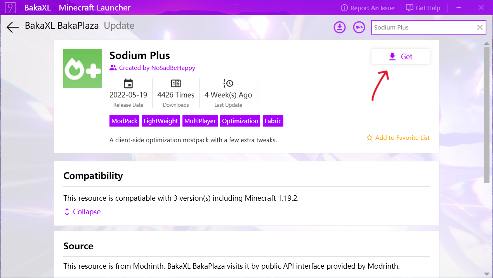

# Playing Modpacks

A modpack is a list of mods bundled with additional files, such as configuration files. In general, it's a modded instance of a game ready to play, or with minor changes.

## How do I create a modpack?

Please see the guide for [creating modpacks](creating_modpacks.md).

## How do I play a modpack?

Currently, the easiest ways to play a Modrinth modpack are via [ATLauncher](https://atlauncher.com), [MultiMC](https://multimc.org), or [PolyMC](https://polymc.org).

### ATLauncher

ATLauncher is a launcher focused on easy integration of modpacks with various different platforms.

Modrinth packs can be installed using ATLauncher in as few as three clicks. Go to the "Packs" tab, select Modrinth on the left, and search for the pack you want. Then, play!

If you just want to insert an ID, slug, or URL directly, you can also do so using the "Add Manually" button by the top-right of the search

If you have a direct link to a Modrinth pack, you also have the option of importing it using the "Import" button in the "Instances" tab.

### BakaXL

BakaXL is a modern launcher with Metro UI on Windows, it supports Modrinth Modpacks in two ways.

#### Install through BakaPlaza

The easiest way to play modpacks using BakaXL is download it from BakaPlaza.

Click "BakaPlaza" Tile in the Start Menu and wait for a second.

Input Modpack name you want to install and click "Search in Modrinth" button, e.g. Sodium Plus.

Select Sodium Plus modpack and then click "Get" button, then choose version.

Choose modpack versions and click "Download" button. You can control target Minecraft version using filters.

Once you click "Download" button and confirmed, the modpack will install immediately.

Then you can return to Start Screen to waiting for modpack.

Once the modpack successfully installed, you can start to enjoy it immediately.

Click Launch button and choose your Minecraft profile to start game.

#### Install manually

This requires you to have an exist modpack file.

Click "Add a new Minecraft Core or Mod Pack" Tile in the Start Menu, then click "Import Modpack"

Click "Continue" and drag modpack file into BakaXL, then wait for modpack to be installed.

### MultiMC and PolyMC

MultiMC and PolyMC are both launchers focused on efficiently managing multiple separate instances, with the latter being a fork of the former. The installation instructions for each are identical.

Modrinth packs can be installed using the "Add instance" button and clicking "Modrinth" on the left. It's as easy as selecting the one you want, and pressing "OK".

If you want to insert a URL directly, you can do so by selecting "Import from zip" instead of "Modrinth".
