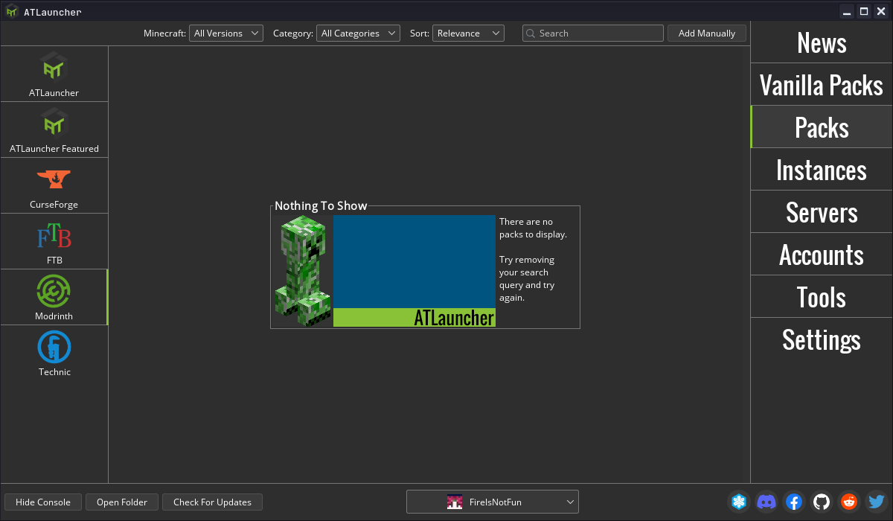
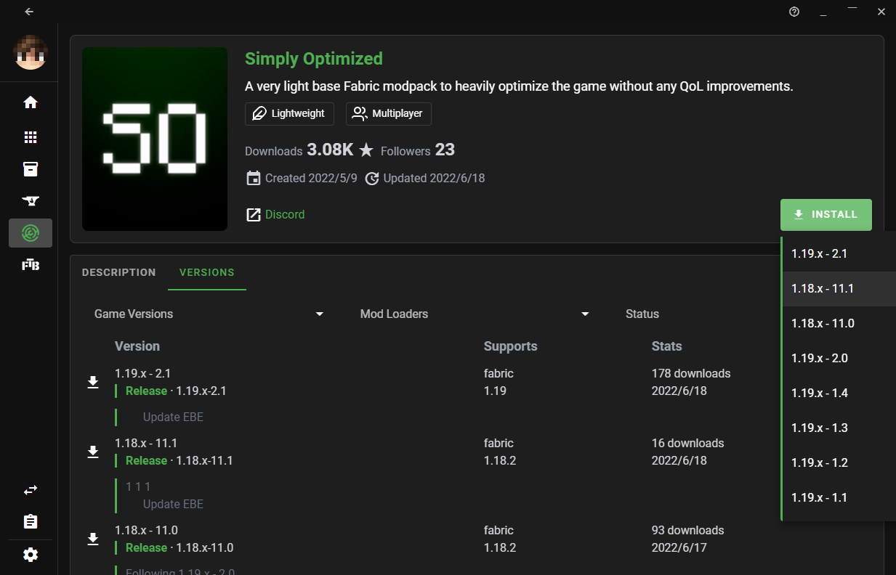
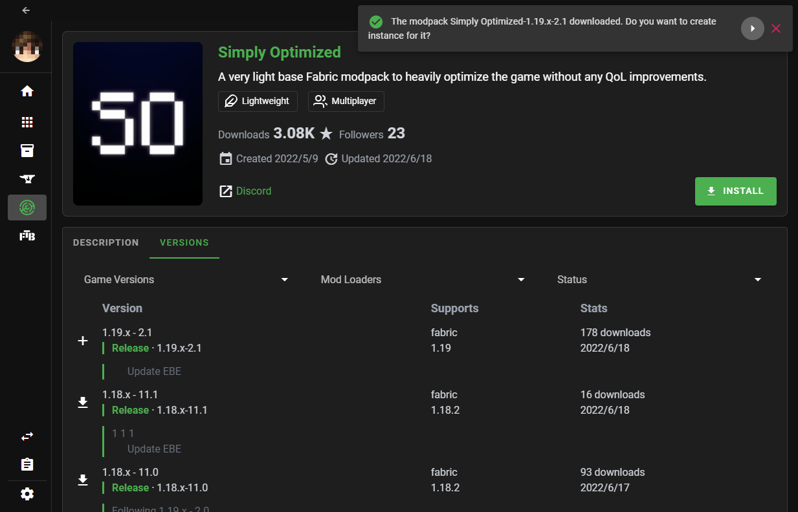
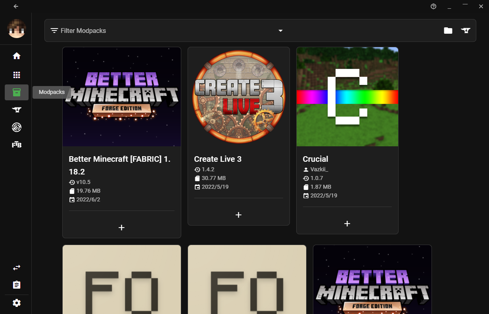

# Playing Modpacks

A modpack is a list of mods bundled with additional files, such as configuration files. In general, it's a modded instance of a game ready to play, or with minor changes.

## How do I create a modpack?

Please see the guide for [creating modpacks](creating_modpacks.md).

## How do I play a modpack?

Currently, the easiest ways to play a Modrinth modpack are via [ATLauncher](https://atlauncher.com), [BakaXL](https://www.bakaxl.com/), [MultiMC](https://multimc.org), [Prism Launcher](https://prismlauncher.org), or [XMCL](https://xmcl.app).
To install a modpack server, try [mrpack-install](https://github.com/nothub/mrpack-install).

### ATLauncher

ATLauncher is a launcher focused on easy integration of modpacks with various different platforms.

Modrinth packs can be installed using ATLauncher in as few as three clicks. Go to the "Packs" tab, select Modrinth on the left, and search for the pack you want. Then, play!

If you just want to insert an ID, slug, or URL directly, you can also do so using the "Add Manually" button by the top-right of the search

If you have a direct link to a Modrinth pack, you also have the option of importing it using the "Import" button in the "Instances" tab.

### BakaXL

BakaXL is a Windows-only launcher primarily targeting Chinese speakers.

#### Install through BakaPlaza

The easiest way to play modpacks using BakaXL is download it from BakaPlaza.

Click "BakaPlaza" in the Start Menu and search for the name of the modpack you want to install.

Select the modpack you want and click the "Get" button, then choose a version to download.

#### Install manually

This requires you to have a modpack file already downloaded.

Click the "Add a new Minecraft Core or Mod Pack" tile in the Start Menu, then click "Import Mod Pack".

Click "Continue" and drag the modpack file into BakaXL.

### MultiMC and Prism Launcher

MultiMC and Prism are both launchers focused on efficiently managing multiple separate instances. The installation instructions for each are identical.

Modrinth packs can be installed using the "Add instance" button and clicking "Modrinth" on the left. It's as easy as selecting the one you want, and pressing "OK".

If you want to insert a URL directly, you can do so by selecting "Import from zip" instead of "Modrinth".

### X Minecraft Launcher (XMCL)

X Minecraft Launcher (XMCL) is an open source Minecraft launcher which provides a disk efficient way to manage massive mods and other resources similarly to MultiMC.

You can find the Modrinth tab on the side bar of the Launcher.

To download modpacks, switch to Modpack in the dropdown on the top:

Click the project card and go to the `Versions` tab. Click the download button in the `Versions` tab or click the `Install` button on the right.

Once the download is finished, ask whether you want to create a new instance. Click the `>` button to open the creation dialog.button to open the creation dialog.

In the dialog, you can review the creation and just click the create button.

#### Manually Import

If you want to import a `.mrpack` file locally, you can just drag and drop the file into the XMCL.

Once you imported the modpack, you can find it in the `My Stuff` - `Modpack` tab in the sidebar.

You can click the `+` button to initiate the instance creation dialog and create the instance of the modpack.
