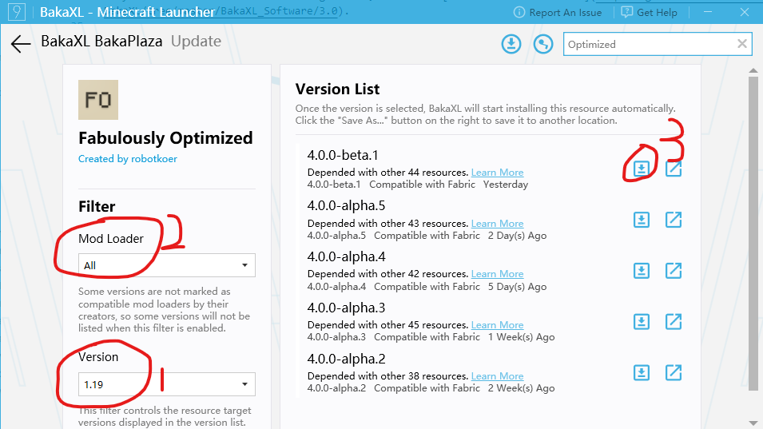
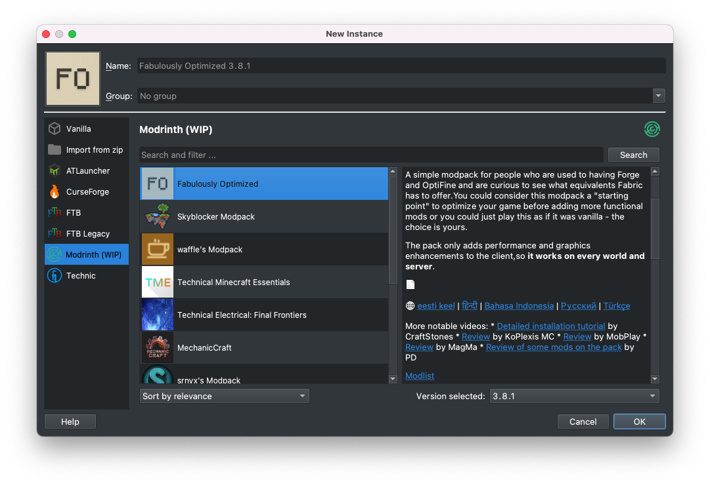

# Playing Modpacks

A modpack is a list of mods bundled with additional files, such as configuration files. In general, it's a modded instance of a game ready to play, or with minor changes.

## How do I create a modpack?

Please see the guide for [creating modpacks](creating_modpacks.md).

## How do I play a modpack?

Currently, the easiest ways to play a Modrinth modpack are via [ATLauncher](https://atlauncher.com) or [PolyMC](https://polymc.org). You can also install Modrinth packs if you switch to the development branch of [MultiMC](https://multimc.org) or [Hello Minecraft! Launcher (HMCL)](https://github.com/huanghongxun/HMCL).

### ATLauncher

ATLauncher is a launcher focused on easy integration of modpacks with various different platforms.

Modrinth packs can be installed using ATLauncher in as few as three clicks. Go to the "Packs" tab, select Modrinth on the left, and search for the pack you want. Then, play!

If you just want to insert an ID, slug, or URL directly, you can also do so using the "Add Manually" button by the top-right of the search

If you have a direct link to a Modrinth pack, you also have the option of importing it using the "Import" button in the "Instances" tab.

### BakaXL

:::caution
This is a Windows-only launcher. 

You must switch to the Parrot or Pigeon Channel of BakaXL to install Modrinth packs. To check whether it is in one of these channels, go to Settings -> Insider Preview . If you are not in one of these channels, click on Sloth Channel and switch. Remember to click on Change button. If you cannot download the update properly, you will need to download the latest version from [BakaXL Jenkins](http://jk-insider.bakaxl.com:8888/).

BakaXL has not been fully translated into English, so you may have trouble in reading texts. If you are interested in translating, check [it](https://github.com/BakaXL-Launcher/BakaXL/tree/master/BakaXL_Software/3.0) out. 
:::

To install Modrinth packs in BakaXL, go to Start Menu -> Add a new Minecraft Core or Modpack (at the upper left corner of the tiles) -> Import Modpack (导入整合包) -> Continue, then drag and drop the .mrpack file to the page. 

You can also use BakaPlaza to install Modpacks. Go to Start Menu -> BakaPlaza, search at the upper right corner. Click on Filters(搜索条件) and click on All Source(所有来源), choose Modrinth. 

Click on the Modpack you want to install, and Get(获取) , then choose a version, and click on its name. BakaXL will automatically install it for you. 

If it's too slow to download the Modpack, go to Settings -> Download, turn off Using mirror source in China Mainland(中国大陆地区使用第三方下载源加速). 

### Hello Minecraft! Launcher (HMCL)

:::caution
You must switch to the beta version of HMCL to install Modrinth packs. To check whether it is in beta version, go to Settings -> General and click Update to check if HMCL is a beta version. Otherwise, you will need to download the latest beta from [GitHub releases](https://github.com/huanghongxun/HMCL/releases).
:::

To install Modrinth packs in HMCL, just drag and drop the .mrpack file to the startup page. That's it!

### MultiMC and PolyMC

MultiMC and PolyMC are both launchers focused on efficiently managing multiple separate instances, with the latter being a fork of the former. The installation instructions for each are identical.

:::caution
When using MultiMC, you must switch to the development branch to install Modrinth packs. To switch to the development version, click the "Settings" button at the top of the window, and change the "Update Channel" to "Development". Then, close the settings and press Update to swap to the development branch.
:::

Modrinth packs can be installed using the "Add instance" button and clicking "Modrinth" on the left. It's as easy as selecting the one you want, and pressing "OK".

If you want to insert a URL directly, you can do so by selecting "Import from zip" instead of "Modrinth".
