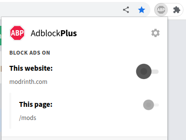
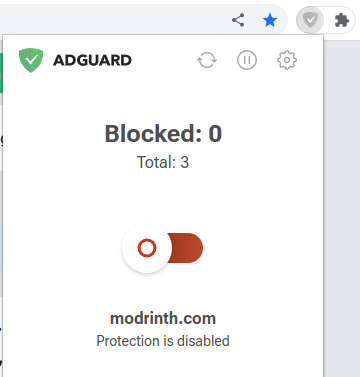
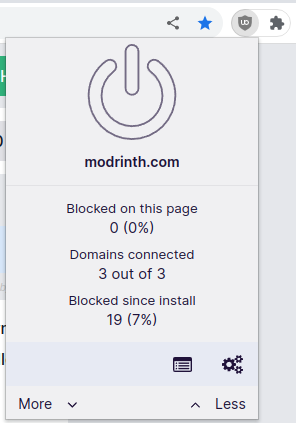

# Modrinth 的广告

Modrinth 使用名为 [Adrinth](https://adrinth.com) 的内部网络。 来自创作者页面 (包括项目和版本) 的 100% 广告收入直接流向创作者。 来自其他页面 (包括搜索) 的广告收入用于支付 Modrinth 的维护费用，并使我们能够继续存在。

Adrinth 广告完全符合 GDPR、CCPA 和其他隐私法，并符合[可接受的广告标准](https://acceptableads.com/standard/)。 每页只有一个，它们的高度小于 120 像素，并且它们与实际站点内容是分开的和可区分的。

虽然您无需关闭广告拦截器即可访问 Modrinth，但您会在此过程中支持 Modrinth 及其创建者。 为了所有相关人员的利益，我们恳请您关闭广告拦截器。 您可以使用右侧的链接跳转至您的浏览器或浏览器扩展程序。

如果显示的方法均无效，或者您对 Adrinth 有更多疑问，请加入我们的 [Discord 服务器](https://discord.gg/EUHuJHt)，以便我们为您提供帮助！

## 浏览器扩展

### AdBlock

AdBlock 可通过单击其徽标进行配置，该徽标位于 "扩展" 按钮内或旁边 (通常是拼图或双右 V 形)。

通过设置面板配置 Adblock

在设置面板中，禁用广告拦截扩展非常容易。只需点击 "在此站点上暂停" 下的 "始终"。

如果这仍然不起作用，您的浏览器可能也有自己的广告屏蔽器。请参阅本页上您的浏览器部分。

### Adblock Plus

Adblock Plus 可通过单击其徽标进行配置，该徽标位于 "扩展" 按钮内或旁边 (通常是拼图或双右 V 形)。

通过设置面板配置 Adblock Plus

在设置面板中，禁用广告拦截扩展非常容易。 只需单击 "此网站" 的开关，并在出现提示时刷新。

如果这仍然不起作用，您的浏览器可能也有自己的广告屏蔽器。请参阅本页上您的浏览器部分。

### AdGuard

AdGuard 可通过单击其徽标进行配置，该徽标位于 "扩展" 按钮内或旁边（通常是拼图或双右 V 形）。

通过设置面板配置 AdGuard

在设置面板中，禁用广告拦截扩展非常容易。 只需单击切换即可完成！

如果这仍然不起作用，您的浏览器可能也有自己的广告屏蔽器。 请参阅本页上您的浏览器部分。

### uBlock Origin

uBlock Origin 可通过单击其徽标进行配置，该徽标位于 "扩展" 按钮内或旁边（通常是拼图或双右 V 形）。

通过设置面板配置 uBlock Origin

在设置面板中，禁用 Modrinth 上的广告非常容易。 只需单击蓝色大电源按钮，然后单击旁边的旋转箭头即可刷新页面。

如果这仍然不起作用，您的浏览器可能也有自己的广告屏蔽器。 请参阅本页上您的浏览器部分。

## 浏览器

### Brave

Brave 有一个内置的广告拦截器，可以通过单击地址栏中的 Brave 徽标进行配置。

从地址栏配置广告设置

要允许从此菜单显示 Modrinth 的广告，请进入 `高级控件` 并将第一个设置更改为 `允许所有跟踪器和广告`。

或者，如果你不熟悉高级选项，也可以直接关闭 Brave 在 Modrinth 上的广告拦截功能。

### Opera

Opera 有一个内置的广告拦截器，可以通过单击地址栏中的蓝色盾牌对其进行配置。

从地址栏配置广告设置

有两种方法可以让 Modrinth 的广告在点击蓝色盾牌后显示。 您可以:
1. 单击广告的 `关闭此网站` 按钮，或
2. 切换 `允许可接受的广告`

最后面板应该是这样的:

如果看不到蓝色盾牌

如果蓝色盾牌不可见，您可以前往 [Opera 的设置](opera://settings/adBlockerExceptions) 手动添加例外。 为 `[*.]modrinth.com` 添加例外。

### Vivaldi

Vivaldi 有一个内置的广告拦截器，可以通过单击地址栏中的盾牌对其进行配置。

从地址栏配置广告设置

要允许 Modrinth 的广告从此菜单中显示，请将 Modrinth 的保护从 `Block Trackers and Ads` 降级为 `Block Trackers`。

如果盾牌不可见

如果盾牌不可见，您可以通过前往 [Vivaldi 的隐私设置](vivaldi://settings/privacy/) 手动添加例外。 为 `modrinth.com` 添加一个例外，并将级别设置为 `Block Trackers`。

