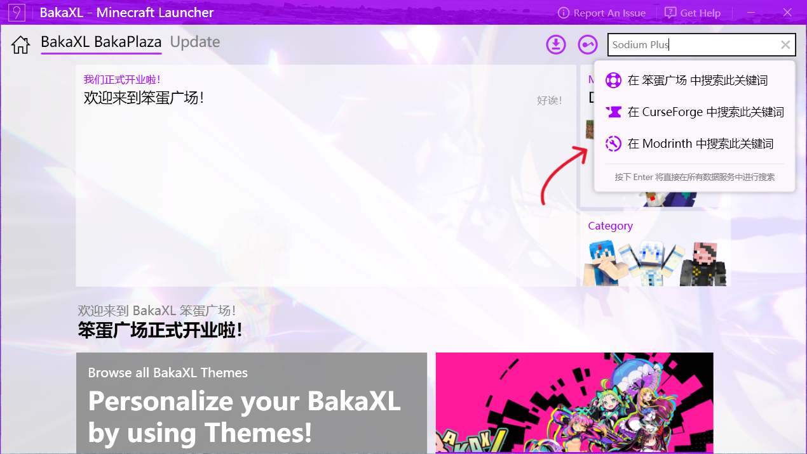

# 游玩整合包

整合包是一系列与其他文件打包的模组，比如模组的配置文件。通常情况下，它是修改过的、做好充分准备的，或者拥有一些小更改的游戏实例。

## 如何创建整合包？

请查看[创建整合包](creating_modpacks.md)的教程。

## 我要如何游玩整合包？

目前，游玩 Modrinth 整合包最简单的方式是使用 [ATLauncher](https://atlauncher.com)，[BakaXL](https://www.bakaxl.com/)，[MultiMC](https://multimc.org)，或者 [Prism Launcher](https://prismlauncher.org) 启动器。
要安装一个整合包服务器，你可以尝试 [mrpack-install](https://github.com/nothub/mrpack-install)。

### ATLauncher

ATLauncher 是一个专注于将模组包与各种不同平台轻松集成的启动器。

只需单击三下，即可使用 ATLauncher 安装 Modrinth 包。 转到 "Packs" 选项卡，选择左侧的 Modrinth，然后搜索所需的包。 然后，开玩！

如果您只想直接插入 ID、别名或 URL，也可以使用搜索右上角的 "手动添加" 按钮

如果您有一个 Modrinth 包的直接链接，您还可以选择使用 "Instances" 选项卡中的 "Import" 按钮导入它。

### BakaXL

BakaXL 是一个主要针对中国大陆地区用户的启动器。

#### 通过笨蛋广场安装

使用 BakaXL 游玩整合包最简单的方式是通过笨蛋广场安装。

点击开始菜单中的 “笨蛋广场” 磁贴，然后搜索你想要安装的整合包。

选择你想要的整合包然后点击 “获取” 按钮，然后选择要下载的版本。

#### 手动安装

这要求您已经下载了一个整合包文件。

点击开始菜单中的 “添加新的 Minecraft 核心或整合包”，然后点击 “Import Mod Pack”。

单击 "继续" 然后将整合包文件拖入 BakaXL。

### MultiMC 和 Prism Launcher

MultiMC 和 Prism 都是专注于高效管理多个独立实例的启动器。 每个的安装说明是相同的。

可以使用 "Add instance" 按钮并单击左侧的 "Modrinth" 来安装 Modrinth 包。 就像选择您想要的那个，然后按 "OK" 一样简单。

如果您想直接插入一个 URL，您可以通过选择 "从 zip 导入" 而不是 "Modrinth" 来实现。
